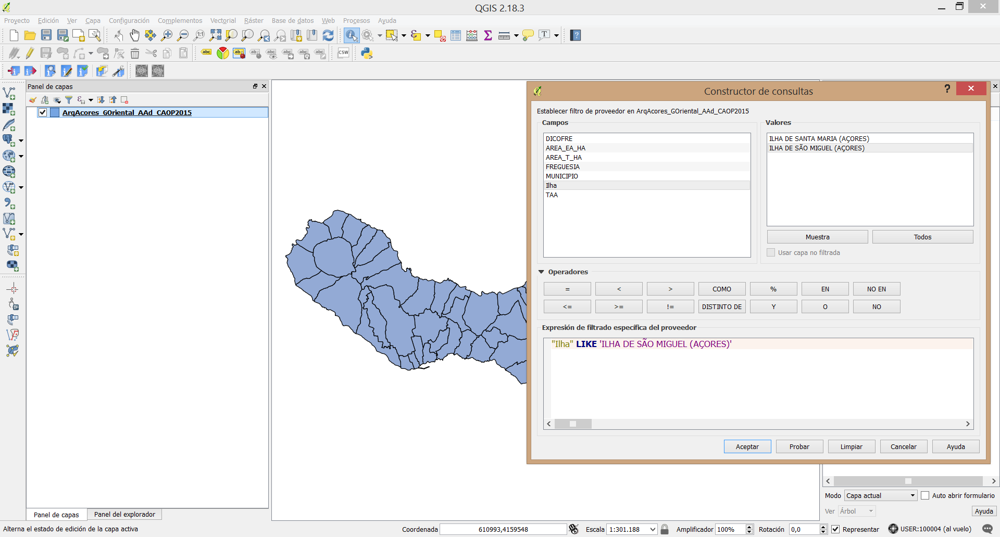
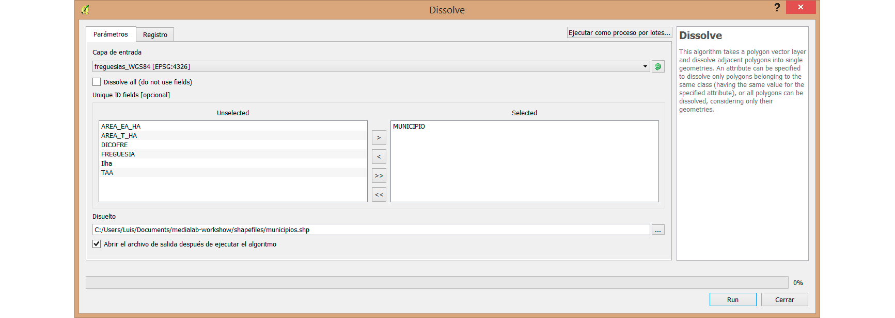
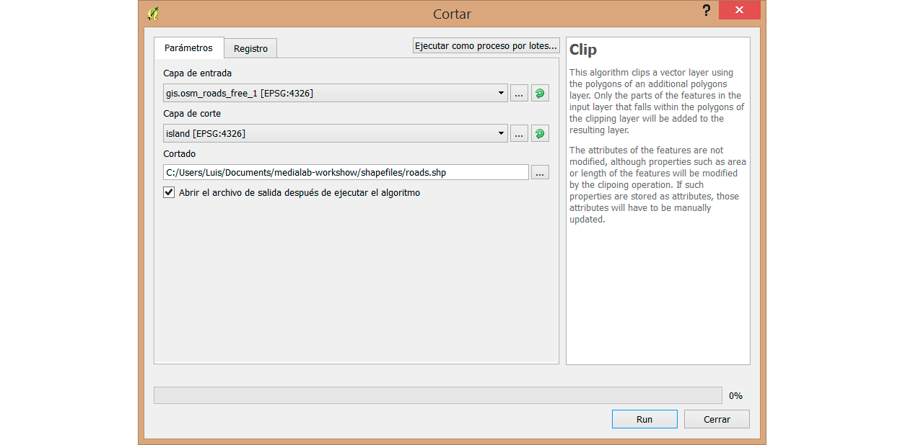

Mapas con QGIS y d3.js
==========

A lo largo de este taller vamos a realizar un mapa utilizando fundamentalmente dos herramientas: el programa libre `QGIS` y la librería javascript `d3.js`.   

Establecereremos el `Windows` como sistema operativo por defecto. Todas las instrucciones estarán adaptadas a esta plataforma. No habrá gran diferencia salvo en los primeros pasos.   

En primer lugar debemos descargar la carpeta del [repositorio](https://github.com/LuisSevillano/QGIS-and-d3js-workshow) en Github. Además, necesitaremos tener instalado:   
- **QGIS**: [enlace de descarga](http://qgis.org/es/site/forusers/download.html).
- **Servidor Virtual** Para poder cargar mapas, csv's, cualquier archivo externo `d3` necesita realizar una petición `http`. Para ello necesitamos un servidor virtual. Podéis utilizar `wamp`, `champ`, `SimpleHTTPServer` de python, etc. Por su sencillez recomiendo utilizar el que trae incorporado [`nodejs`](https://nodejs.org/es/download/).  
  - Descargamos `node` de la página oficial.  
  - Abrimos una consola o `prompt` tecleando `cmd` en el menu inicio de Windows o una terminal en Ubuntu.
  - Instalamos `http-server` con el siguiente comando:
        npm install http-server -g
  - Ya tenemos servidor virtual. Podemos movernos por el sistema de carpetas desde la consola o ir directamente a la carpeta donde tendremos nuestros archivos y abrirla allí y teclear: `http-server`.
  - Por si alguien tuviera algún problema este post explica todos los pasos: [Instalar nodejs](http://www.jhh.me/blog/2012/12/24/setting-up-http-server-on-windows-with-node-js/)  
  - No vamos a utilizar este sevidor virtual hasta el final del taller por lo que podemos continuar mientras instalamos `node`.
- Archivos `Shapefile`. Para no perder tiempo en descargar todos los archivos de las fuentes oficiales los he subido a un link de [wetranfer](https://wetransfer.com/downloads/fb7aeaed5622409a73fba5947457074220170218030228/d09c17eea951db8432d45d514000daff20170218030228/ff672e).

### QGIS

El objetivo de este taller es aprender cómo QGIS puede ser una buena herramienta para trabajar con nuestros archivos `shapefile` en una fase previa a la representación de los mismos con `d3js`.  

Desde un punto de vista periodístico, QGIS nos permite:
- Filtrar las entidades geoespaciales contempladas en cada uno de los archivos. Los shapefiles pueden (y suelen) tener asociada una tabla de atributos. Como en cualquier tabla podemos tener datos del tipo: _ids_, nombre, población, altitud, etc.  

- Obtener nuevos shapefiles tras _cortarlos_ (`clip`) con otros archivos del mismo tipo: Imaginemos que tenemos un archivo con todas las carreteras de un país pero nos interesa preservar sólo aquellas que se encuentran bajo nuestro objeto de estudio (un municipio, una isla, el contorno de una ciudad, etc.).  
Podemos lograr que el polígono de éste municipio _corte_ al archivo que se extiende más allá de estos limites y generar así un archivo menos pesado con el que será más fácil trabajar.   

- Cruzar los _ids_ de los polígonos con otro tipo de archivo (por ejemplo un `csv`) y asociarlos a los polígonos.  

- Generar nuevos datos. QGIS posee una herramienta llamada `calculadora de campos` que nos permite realizar operaciones con el objetivo de crear nuevas variables.  

- También podemos hacer lo contrario. Pasar de unidades muy cocretas a unas más grandes. Para ello existe la opción `disolver`. Esta herramienta crea nuevas unidades geoespaciales _mergeando_ (uniendo) otras. Por ejemplo podríamos obtener el contorno de la ciudad de Zaragoza desde un shapefile de sus barrios. En este caso _disolveríamos_ todos los polígonos y nos quedaría uno solo, el contorno.  

 También podríamos ir nivel a nivel: imaginemos un shapefile que contempla las secciones censales de una ciudad y nosotros queremos obtener un shapefile de los distritos. Una buena tabla de atributos asociada debería tener en cada fila:
  - código sección censal
  - código distrito
  - nombre distrito
  - etc.    

  Podríamos obtener un shapefile de los distritos **uniendo** (disolviendo los límites entre) todos aquellos que compartan el mismo `id` de distrito.

No hay que olvidar que QGIS es un software GIS dedicado al análisis geoespacial y sus aplicaciones y potencial es mucho mayor. Aquí veremos éstas herramientas y alguna más aplicadas a la representación de valores sociodemográificos o culturales.  

QGIS es una interfaz gráfica basada parcialmente en `python` y muchos de sus métodos y aplicaciones se pueden realizar directamente utilizando la línea de comandos.

## São Miguel, Azores
En este taller tendrémos como objetivo crear un mapa de la tasa de desempleo en la isla portuguesa de São Miguel, Archipiélago de las Azores.  

La Región Autónoma de las Azores es un grupo de nueve islas portuguesas ubicadas en el océano Atlántico. Posee tres grupos y la isla de São Miguel, capital de la región, se encuentra englobada en el grupo Oriental.  
No he conseguido encontrar un shapefile de municipios portugueses. Por lo tanto, nuestro archivo de salida será un shapefile del grupo oriental dividido en _freguesías_, el nivel administrativo por debajo del municipal de los países lusófonos (antiguas parroquias católicas).

De paso, utilizaremos algunas de estas herramientas que hemos comentado. Pasos:     
1. El archivo `ArqAcores_GOriental_AAd_CAOP2015.shp` de la carpeta Shapefiles del repositorio. Lo abrimos con `QGIS`: En las opciones del panel superior de la interfaz seleccionamos **Capa** → **Añadir Capa** → **Añadir capa vectorial** (`utf-8`).
Vemos las dos islas pertenecientes al grupo oriental: São Miguel y Santa María.

2. A continuación vamos a descartar la segunda. Botón derecho sobre la capa → **filtrar**. Se nos abre el `Constructor de consultas`: a la izquierda los campos de la tabla de atributos, abajo los operadores y a la derecha todos los valores de los campos. Debajo de los operadores construimos nuestra _consulta_:   
        "Ilha" LIKE 'ILHA DE SÃO MIGUEL (AÇORES)'   

 

 Aceptamos. Tenemos nuestra isla. Siguiente.

3. A continuación vamos a guardar nuestro nuevo shapefile. Botón derecho sobre la capa seleccionamos `guardar como`. En la pestaña de `SRC` . Seleccionamos `WGS84`. Seleccionamos la opción `Añadir archivo guardado al mapa`. Guardamos y nuestro nuevo shapefile filtrado y bajo el sistema de coordenadas `WGS84` se ha añadido a nuestro _canvas_ o espacio de trabajo. Eliminamos la capa anterior.   

4. Actualmente el shapefile muestra las _freguesías_. Si abrimos la tabla de atributos (botón derecho sobre la capa → abrir tabla de atributos) observamos que tenemos un campo `municipio`. Una buena oportunidad para poner en práctica la herramienta **disolver**.

5. Disolver un polígono: **Vectorial** → **Herramientas de geoproceso** → **Dissolve**. IMPORTANTE:
 - debemos comprobar que la opción `Disolve All (do not use fields)` no se encuentra seleccionada.
 - Cerciorarnos de que estamos actuando sobre la capa deseada.
 - En la opción **Disuelto**, seleccionar dónde y con qué nombre vamos a guardar el archivo resultante.
 - Añadimos el campo **Municipio** al panel `Selected`.

 Con este paso vamos a generar un nuevo shapefile uniendo aquellas _freguesías_ que comparten el mismo nombre de municipio. En un escenario ideal estas operaciones las haríamos utilizando _id's_.  

 

 Vamos a realizar la misma operación sin deseleccionar la opción `Disolve All` para obtener el contorno de la isla. Nos será útil más adelante.   

6. A continuación vamos a añadir un `csv` con los datos de desempleo por municipios. Vamos a utilizar los datos del [PORDATA](http://www.pordata.pt/Municipios/Taxa+de+desemprego+segundo+os+Censos+total+e+por+sexo+percentagem-405), el portal de datos abiertos del país luso. Son los datos de desempleo más recientes que he encontrado (2015). El csv se encuentra en la carpeta `data` del repositorio.   

 QGIS tiene una opción muy completa para añadir capas de texto delimitado (csv, tsv, etc.). A día de hoy no he conseguido utilizar esta opción para añadir un csv y no perder los ceros por la izquierda en los ids. Por ello añadiremos nuestro csv como hemos hecho anteriormente con los shapefiles (añadir capa vectorial). Añadimos el archivo y aparece en el panel de capas como una más.  

7. A continuacíon haremos una `Unión` o _join_ entre el csv y el shapefile de municipios. Hacemos click con el botón derecha sobre nuestro shapefile → **propiedades** → **Uniones**. Seleccionamos la capa con la cual queremos hacer el `join` y los dos campos que cruzaremos (`id` y `DICOFRE`) Podemos elegir qué campos queremos unir, en este caso sólo nos interesa el de desempleo (desemprego).  

 

8. Si abrimos la tabla de atributos veremos como hemos añadido un nuevo campo. **PERO** es un campo _virtual_, sólo existe temporalmente y no en el shapefile original. Además, no podremos hacer operaciones sobre el mismo. Si creamos una copia de este shapefile se añadirá el nuevo campo como uno más. **botón derecho** → **guardar como** → etc.  

9. Usando **Open Street Maps**. En la carpeta shapefiles he incluido dos archivos de OSM (Open Street Maps): `carreteras` y `landuse`. El objetivo es aprender a utilizar la herramienta **cortar**.  

 Como mencionabamos arriba esta herramienta nos permite _filtrar_ en base a una geometría. Los archivos tienen todas las carreteras y usos del suelo de Portugal contempladas en OSM. A nosotros tan sólo nos interesan las de São Miguel. Vamos a hacer el proceso en dos partes:
 - Filtrar carreteras. OSM tiene un campo `fclass` que denomina la característica de ese vector. Respecto a carreteras tiene muchos tipos: `primary`, `secondary`, `path`, `footway`,`service`, etc. Vamos a seleccionar algunas por lo tanto filtramos el shapefile:
          "fclass" IN ('tertiary','secondary','primary','path')
  - Cortar: Utilizaremos ahora el contorno de la isla que disolvimos en los primeros pasos. **Vectorial** → **Herramientas de geoproceso** → **Cortar**. Seleccionamos la capa de entrada (la que será cortada) y como capa de corte el shapefile del contorno de la isla.  
  - Podemos hacer lo mismo con la capa de landuse. Filtramos: `"fclass" IN ('forest','residential')`: de entre todas las categorías que contempla este shapefile (`industrial`,`park`,`nature_reserve`, etc.) seleccionamos las entidades de tipo residencial y bosque.   

    

  Ya tenemos todos nuestros archivos preparados para empezar a trabajar con d3js.

### d3.js

Data Driven Documents ([d3.js](https://d3js.org/)) es una librería javascript creada por [Mike Bostock](https://twitter.com/mbostock) destinada a la representcion de datos. Es una herramienta super completa que contempla infinidad de soluciones, algoritmos y métodos. Por supuesto incluye un extenso paquete relacionado con mapas.  

Existe todo un _ecosistema_ de aplicaciones que orbitan alrededor de d3, muchas de ellas creadas entera o parcialmente también por Mike Bostock. Una de ellas es [**TopoJSON**](https://github.com/TopoJSON/TopoJSON). Además de ser un formato incluye también una aplicacíon por línea de comandos que ha presentado recientemente su segunda versión (`TopoJSON.v2`). Esta `CLI` (command line interface) permite hacer infinidad de cálculos y operaciones con mapas: filtrar, crear nuevas propiedades, cruzar un shapefile con un csv, etc. Como formato presenta la virtud de ser mucho más ligero que un `GeoJSON`.  

Además, TopoJSON es el formato de archivo con que se suelen representar mapas con `d3js`. Existen otras extensiones como GeoJSON, más pesadas.   

Es importante tener claro que con `d3` **NO** podemos leer shapefiles por lo que tendremos que convertir los shapefiles anteriormente generados a este formato. TopoJSON permite contener dentro tantos objetos como queramos: uniremos los anteriores shapefiles en un solo archivo.  

Para instalarlo tan sólo debemos ejecutar el siguiente comando:   

    npm install topojson@v1 -g

Como decíamos arriba topojson va por la `v2`. Esta nueva versión ha cambiado por completo su sintaxis y ha incluido muchas nuevas funcionalidades interesantes. En este caso vamos a utilizar la versión primera por tener una sintaxis más intuitiva.  

La aplicación por línea de comandos de TopoJSON es extensa e incluye multitud de opciones relativas a la `Command-Line Cartography`, requeriría de un taller propio. Vamos a pasar por encima y veremos un comando con el que realizaremos todos los pasos necesarios. Es el siguiente:

          topojson roads.shp landuse.shp island.shp municipalities.shp --width 960 --height 300 --margin 20 -s .25 --projection "d3.geoMercatorRaw" -p -o map.json

Aquí lo vemos _ordenado_:

          topojson \
          roads.shp landuse.shp island.shp municipalities.shp \
          --width 960 \
          --height 300 \
          --margin 20 \
          -s .25 \
          --projection "d3.geoMercatorRaw" \
          -p \
          -o map.json

- Al principio pasamos los tres `shapefiles` que queremos _mergear_ en un sólo json. No necesariamente ha de ser en este orden.  
- Le pasamos unos atributos relativos al escalado y márgenes del mapa `widht`,  `height`, `margin`  .
- Con `-s` especificamos el grado de `simplificación` que lleva a cabo topojson. Una función que tiene como objetivo reducir más aun el peso del archivo.   
 Topojson tiene otro método llamado `quantization` para una labor similar. Mientras la simplificación elimina puntos en los polígonos, la quantización reduce el numero de decimales y por tanto también la precisión en las coordenadas relativas a estos polígonos.
- con `-p` preservamos todas las propiedades del shapefile. Sin su uso perderíamos todo atributo que no participara de la geometería (nombre, id, etc.).   

El comando está pensado para ser ejecutado en la consola desde la carpeta donde se encuentren los archivos.  
Si alguien tuviera algún problema con la ejecución del comando el archivo se encuentra en la carpeta `canvas-map/simple/map.json`.

A continuación vamos a empezar a realizar nuestro mapa en `d3js`. Iremos recorriendo cada una de las líneas el mapa. Podéis encontrar el archivo en la carpeta `canvas-map/simple/index.html`.   
